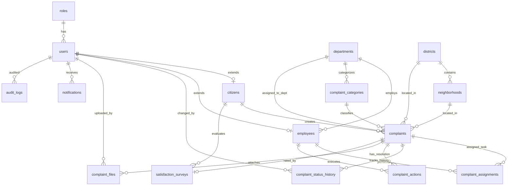

# Veritabanı ER Diyagramı (16 Tablo) 🗄️

Belediye Talep ve Akıllı Şikâyet Yönetim Sistemi'nin 16 veritabanı tablosu ve Foreign Key ilişkileri aşağıdaki Mermaid diyagramında gösterilmiştir:

---

## Tablo Sorumluluk Özeti

1. `roles`: Kullanıcı rol tanımları (Vatandaş, Personel, Birim Yöneticisi, Admin).
2. `users`: Tüm sistem kullanıcı hesapları ve şifre hashleri.
3. `citizens`: Vatandaş kimlik ve adres detayları.
4. `departments`: 10 varsayılan belediye müdürlüğü.
5. `employees`: Personel unvan ve bağlı müdürlük bilgisi.
6. `complaint_categories`: Şikâyet kategorileri ve sorumlu birim eşleşmesi.
7. `districts`: İlçe listesi.
8. `neighborhoods`: Mahalle listesi.
9. `complaints`: Ana talep verileri, takip kodları, AI tahminleri ve durumlar.
10. `complaint_assignments`: Yönetici tarafından personele atanan görevler.
11. `complaint_status_history`: Tüm durum değişimlerinin tarihçesi.
12. `complaint_actions`: Personelin yaptığı çalışmalar ve çözüm detayları.
13. `complaint_files`: Yüklenen resim ve belgeler.
14. `notifications`: Sistem içi kullanıcı bildirimleri.
15. `satisfaction_surveys`: Vatandaşların 1-5 yıldız değerlendirmesi ve yorumu.
16. `audit_logs`: Sistem güvenlik ve denetim logları.
